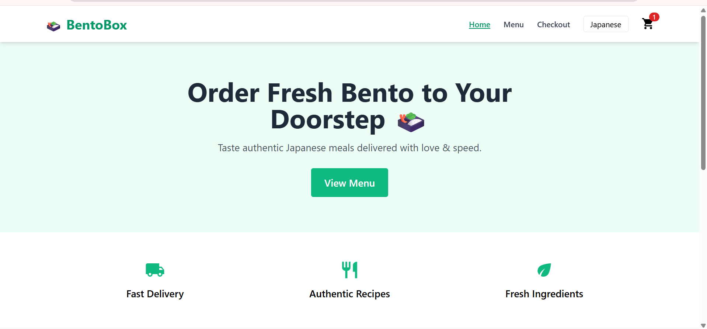

# 🍱 BentoBox – React Food Ordering App

BentoBox is a modern food ordering UI built with **React + Vite**, styled with **Tailwind CSS**, and powered by **Zustand** for global state management.  
The project supports **multi-language (EN/JA)** switching and includes features commonly found in production-level food delivery apps.



---

## 🚀 Features

- 🖼️ Clean landing page with Hero, Features, and Popular Dishes
- 🧾 Menu page with:
  - Responsive card layout
  - Category filters & search
- 🛒 Cart drawer with:
  - Add/remove/increment/decrement items
  - Zustand-powered global state
  - LocalStorage persistence
- 🌐 Language switcher (English 🇺🇸 / Japanese 🇯🇵)
- 🍞 Toast notifications (react-hot-toast)
- 💅 TailwindCSS for modern styling
- ⚡ Built with Vite for fast dev experience

---

## 🧱 Tech Stack

- **Frontend:** React, Vite, Tailwind CSS
- **State Management:** Zustand
- **Internationalization:** react-i18next
- **Notifications:** react-hot-toast
- **Routing:** React Router
- **Animations:** Framer Motion

---

## 🌐 Multi-language Support

Supports both:
- 🇺🇸 English (default)
- 🇯🇵 Japanese (via language toggle)

All menu items and UI texts are fully localized using `i18next`.

---

## 🛠️ Installation & Running Locally

```bash
# Clone this repo
git clone https://github.com/yourusername/bentobox.git

# Navigate to project
cd bentobox

# Install dependencies
yarn

# Start development server
yarn dev
